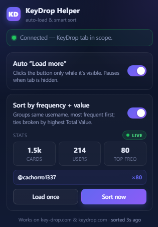

# KeyDrop Helper

> Chrome extension for **key-drop.com** and **keydrop.com** that auto-clicks "Load more", groups giveaway cards by username frequency and Total Value, and shows live stats — all in a clean popup UI.

<p align="center">
  
</p>

<p align="center">
  
  
  
  
</p>

---

## What it does

KeyDrop Helper is a **Chrome / Edge / Brave** browser extension built for the CS2 (CS:GO) skin giveaway platform **Key-Drop**. It automates two things that are tedious to do by hand on the giveaways page:

1. **Auto Load more** — continuously clicks the "Load more" button so you can see every active giveaway without scrolling and clicking forever.
2. **Smart sort** — visually groups giveaway cards by **username frequency**, then by **Total Value** inside each group, so you can spot which creators or whales are spamming the most giveaways at a glance.

A small popup gives you live stats: how many cards are visible, how many unique users, and who's the most frequent poster.

## Features

- **Auto "Load more"** with a hard **1-second delay between clicks** so the site doesn't rate-limit you with the "Something went wrong" error overlay.
- **Smooth in-place sort** — only the cards that are actually out of position are moved (`insertBefore` diff walk). No flicker, no re-render of the whole list.
- **Live stats**: visible cards, unique usernames, top frequency, and the name of the top user. Numbers flash purple when they change.
- **LIVE badge** with a pulsing green dot when auto-sort is active.
- **iOS-style toggle switches**, smooth fade-in animations, modern gradient background.
- **Sort now** / **Load once** action buttons for manual triggers.
- **Site error detection** — when KeyDrop shows "Something went wrong / An unexpected error has occurred / Try again", the extension pauses auto-load for 5 seconds and clicks the page's own "Try again" button to recover.
- **Self-healing** — re-binds the card list when KeyDrop swaps it (SPA navigation, skeleton-fill load-more), pauses both loops when the tab is hidden, and pushes live stats to the popup roughly twice per second.
- **Auto-injects** the content script if the tab was loaded before the extension was installed, so you don't have to manually refresh the KeyDrop tab.
- **No telemetry, no tracking, no external requests.** Everything runs locally in your browser.
- **Domain-scoped** — only runs on `key-drop.com` and `keydrop.com` subdomains.

## Install (unpacked)

1. **Download** this repo as a ZIP (green "Code" button at the top right → "Download ZIP") and extract it, or clone it:
   ```
   git clone https://github.com/kubaam/keydrop-helper.git
   ```
2. Open `chrome://extensions` (or `edge://extensions`, `brave://extensions`).
3. Toggle **Developer mode** on (top-right corner).
4. Click **Load unpacked** and select the `keydrop-helper` folder.
5. The KeyDrop Helper icon appears in your toolbar. Pin it for easy access.

## Usage

1. Visit [key-drop.com/giveaways](https://key-drop.com/en/giveaways/list) (or `keydrop.com` — both work).
2. Click the KeyDrop Helper toolbar icon to open the popup.
3. Toggle **Auto "Load more"** to start loading every active giveaway.
4. Toggle **Sort by frequency + value** to group cards by the user posting them.
5. Watch the LIVE stats update in real time.
6. Use **Load once** for a single Load More click, or **Sort now** to force a re-sort immediately.

Both toggles persist across browser restarts (stored via `chrome.storage.local`).

## Sort logic

Cards are grouped by **lowercased username** as the primary key.

1. Inside each group, items are sorted by **Total Value descending**.
2. Groups themselves are sorted by:
   - **Frequency descending** (most posts first), then
   - **Highest Total Value in group descending** (ties broken by biggest single giveaway), then
   - **Username ascending** (numeric-aware, locale-aware).

The final flat order is applied to the live DOM with a minimum-move algorithm — only nodes that are not already in their target position get moved.

## How it stays fast

- **Scoped MutationObserver** on the giveaway list (`[data-testid="div-user-giveaways-list-section"]`), not the whole page body.
- **Filtered mutations** — only `<a>` and `<li>` additions/removals trigger a sort; image loads, hover state changes, and other noise are ignored.
- **Body observer** kept alive as a self-healer for SPA re-renders, throttled to 300 ms callbacks and cheap when the list is still mounted.
- **IntersectionObserver** on the Load More button — clicks only fire when the button is actually visible on screen.
- **Page Visibility API** — when the tab is hidden, both loops pause; resume on return.
- **Throttle floor** of 150 ms between consecutive sorts to prevent thrash on bursty mutations.
- **Stats pusher** runs every 700 ms regardless of toggle state, so the popup is always live.

## Compatibility

- **Browsers**: Chrome, Microsoft Edge, Brave, Opera, Vivaldi, Arc — anything Chromium-based that supports **Manifest V3**.
- **Sites**: `key-drop.com`, `keydrop.com`, including all subdomains (`www`, `eu`, etc.).
- **OS**: Windows, macOS, Linux (extension runs in the browser, OS doesn't matter).

## Tech

- **Manifest V3** Chrome extension — no background service worker, content script + popup only.
- **Vanilla JavaScript**, no frameworks, no build step, no dependencies.
- **Permissions**: `storage`, `activeTab`, `tabs`, `scripting`. Host permissions limited to KeyDrop domains.
- **Tested** on Chrome 120+ and Edge 120+ on Windows.

## Project structure

```
keydrop-helper/
├── manifest.json     # MV3 manifest, host_permissions, content_scripts
├── content.js        # Sort engine, observers, auto-load loop, site error detection
├── popup.html        # Popup UI (toggles, stats, action buttons)
├── popup.js          # Popup logic, polling, auto-inject fallback
├── gui.png           # Screenshot for README
└── README.md
```

## Changelog (highlights)

- **v2.4.0** — Popup auto-injects the content script via `chrome.scripting` if the tab predates the extension install. No more "Reload the KeyDrop tab" friction.
- **v2.3.0** — Targets `<ul data-testid="div-user-giveaways-list-section">` directly. List observer upgraded to `subtree: true` with `<a>`/`<li>` filter to catch KeyDrop's skeleton-fill load-more pattern. Renamed busy attribute to `data-kdh-busy` to avoid collision with the site's own attribute.
- **v2.2.0** — Manifest wildcards for all subdomains. Site error overlay detection with auto "Try again" click. 1-second mandatory delay after each Load More click.
- **v2.1.0** — Smooth in-place reorder (no flicker), scoped MutationObserver, IntersectionObserver for Load More, page-visibility pause, live stats in popup, modern UI with toggle switches and LIVE badge.
- **v2.0.0** — Domain-scoped permissions, popup tab-scope detection, robust money parsing, fallback selectors, mutation observer + debounced sort.

## Privacy

KeyDrop Helper makes **zero network requests**. It only reads and rearranges the DOM of pages you visit on the KeyDrop domains. Your toggle preferences are stored in `chrome.storage.local`, which never leaves your machine. No analytics, no tracking pixels, no external scripts.

## Disclaimer

This is an **unofficial, fan-made** browser extension. It is **not affiliated with, endorsed by, or supported by** Key-Drop, KeyDrop, KeyDrop.com, Valve, Steam, or any related entity. It does not bypass any security, rate limits, or terms of service — it only automates clicks and reorders DOM elements that are already visible to the user. Use at your own risk. **18+ only. Play responsibly.**

## License

This project does not yet ship with a license file. All rights reserved by the author until a license is added.

---

**Keywords:** key-drop, keydrop, key-drop.com, keydrop.com, KeyDrop extension, KeyDrop helper, KeyDrop auto load more, KeyDrop sort, KeyDrop giveaways, KeyDrop tools, CS2 skins, CS:GO skins, CSGO skins, Counter-Strike skins, Steam skins, giveaway sorter, browser extension, Chrome extension, Edge extension, Brave extension, Manifest V3, MV3, auto-clicker, giveaway helper, skin gambling helper, CS2 giveaways, free CS2 skins, KeyDrop bot (not a bot — automation helper), KeyDrop Plus alternative.
